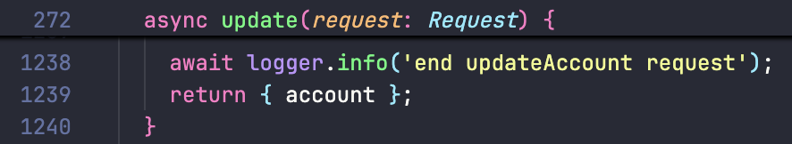
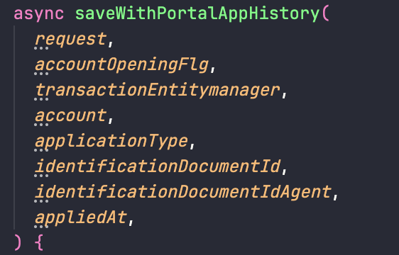
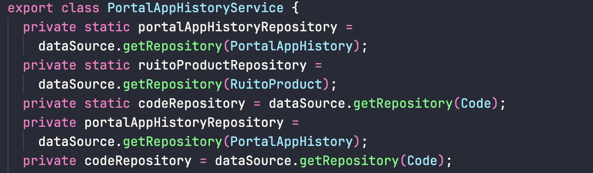
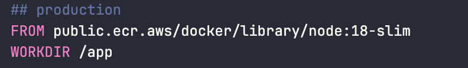
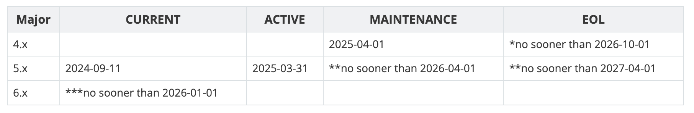
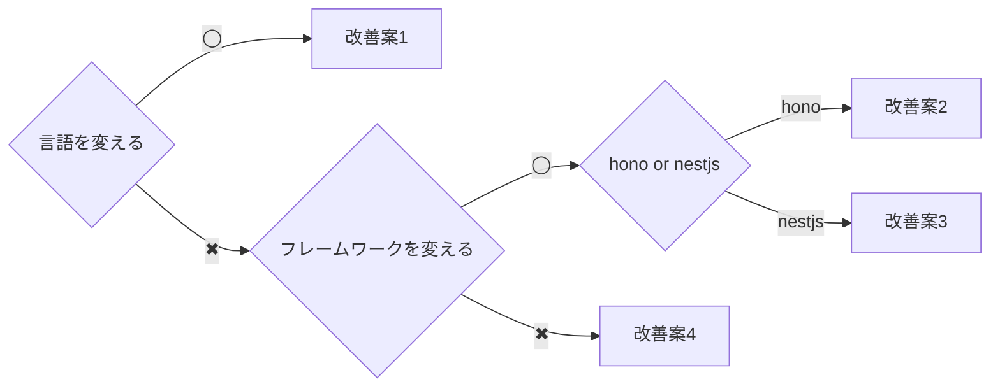

# account-apiのリファクタリング

---
transition: slide-left
---

# account-apiのつらいところ

- **巨大なAPI** - 一つのAPIで更新処理を全て担当している
- **any型** - 多くの場所で型がanyになっている
- **破壊的な関数** - 渡した値の中身が書き換えられる
- **テスタビリティが低い** - サービス、コントローラーなどの境界が曖昧で密結合
- **古いバージョン** - Nodeがv18、Expressがv4
- **Express機能の活用** - ルーター、ミドルウェア

---
transition: slide-left
---

# 巨大なAPI

各種申込などで使われるupdateAccountのコントローラーが膨大(1000行)

全ての申し込みが関わるので一つの申込に関して修正が入ったとき全ての申込をテストしなければならなくなる

[該当のコード](https://github.com/ichiyoshi-i3design/account-api/blob/c56bbe7dc8ae82551d4ff065b15373f6b5296c03/src/controller/AccountController.ts#L272)



<!--
普通にデカすぎ
-->

---
transition: slide-left
---

# any型

引数に型がつけられていないのでany型になっており、どんな値が入ってくるか実行して確かめるまでわからない



<!--
コードを追う時、関数の中を見て、フロントのコード見て、実行してみて、やっとわかる

tsconfig.jsonでstrict=trueにすれば解決する
-->

---
transition: slide-left
---

# 破壊的な関数

関数内で`param`の値を書き換えており、事故が起こりそう

[該当のコード](https://github.com/ichiyoshi-i3design/account-api/blob/c56bbe7dc8ae82551d4ff065b15373f6b5296c03/src/service/ReplaceCoreDataService.ts#L42)


<!--
気を付ければいいって話だが、その脳みそを使うのが疲れるし無駄
-->

---
transition: slide-left
---

# テスタビリティが低い

例えば画像のコントローラだと、コントローラーを初期化した時にはもうデータソースが初期化されているのでコントローラーのテストをやろうとした時にDBに繋いでしまう

[該当のソースコード](https://github.com/ichiyoshi-i3design/account-api/blob/c56bbe7dc8ae82551d4ff065b15373f6b5296c03/src/service/PortalAppHistoryService.ts#L49)

[DIサンプルコード](https://www.typescriptlang.org/play/#code/JYOwLgpgTgZghgYwgAgMJwDYIK4bpKZAbwChlzkBBAE2oC5kAKOBkbAWwCNoAaZT1h25QAlMgC8APmRsu0EgF8SJBAHsQAZzDIEmHHgIN0WXPmgTiZCjXpM4fTmKnI4yANT9FytZu1g4GgDWlBaMTtKkFDrqWshQEBq42uI6eqYEAHQ2jACMPABMIlbkPhqqGBAZGKoA5ozxiRhgRUoqMX4BgQBCoQhGaQbQ4ZZRpdoNSRYIWbS5BUWjMeWV1XUTTS0kQA)



<!--
DIすればいい感じになる
-->

---
transition: slide-left
---

# 古いバージョン - node -

v24かv22に変更した方が良さそう

[nodeのサポート状況](https://nodejs.org/ja/about/eol#eol%E3%83%90%E3%83%BC%E3%82%B8%E3%83%A7%E3%83%B3)




---
transition: slide-left
---

# 古いバージョン - express -

v5だとasync/awaitに対応しているので使いやすい
セキュリティ関連(DoS)のアップデートもあったので上げた方が良さそう
v4のサポート期間的には1年ほど余裕がある




---
transition: slide-left
---

# Express 機能の活用 - ルーター -

ルーティングを機能ごとにまとめることができる

##### router未使用

```typescript
const app = Express();
app.get('/calendar/events', (req, res, next) => {
  // ..
})
```

##### router使用

```typescript
const app = Express();
const router = Router();
router.get('/events', (req, res, next) => {
  // ..
})
app.use('/calendar', router)
```

---
transition: slide-left
---

# Express 機能の活用 - ミドルウェア -

処理の前後にミドルウェアを入れることができる

##### middleware未使用

```typescript
const app = Express()

app.get("/", (req, res, next) => {
  console.log('Time:', Date.now())
  // ..
})
```

##### middleware使用

```typescript
const app = Express()

app.use((req, res, next) => {
  console.log('Time:', Date.now())
  next()
})

app.get('/', (req, res, next) => {
  // ..
})
```

---
transition: slide-left
---

# 改善方針/案

ドメイン駆動開発を取り入れて業務プロセスをプログラムで表現する

[ドメイン駆動サンプルコード](https://www.typescriptlang.org/play/#code/PQKgBIJAqFUMhrDIHQyHKGQ9QyAmGMJgCgDGAbAhgM6FgCqhApgE4CSAJmAN6ZitjYD2AdoQC5UBXbLw5UAFAAcqASwBu+XhTBUK+Ot1wBPMAH15uARQBcYLgIC2AI2oBKRgF8WbAOYVeYfYbE2mTtmxVeASouMF4AC2lCADo9fAMKAG4-MEdHTFBIWERUdCw8IhIAOXxzJWZ-Th5+IRFxKTkFJRU1DW04hJMzK1sHFNd3TwpvX39-QODQiKjYoeT-NMwM8Gh4ZDQMHAJiMABBV1G2Kr5BYVFJGXlFZVV1Li1dIa6Layo7R38Bj3ivHwqx1gTEJhSIxDqGeZsRbLMCACoZAM8MgDGGQDFDCi8ltCmRKFRDqxjjUzvVLk1dNI6CZyNR6AAaMANK5KHRcUrGMAlMq0+kknT4VwmfYUd5LT5uMBkkb-AFAqag2JklLpEXuKK7OgCXC8CUpcZuSYgmY81zRIZgAB8AF4wABGAAcCuFLlFzLK3klY2l+rBzooxp+SXtKUo7hU3rEXBM7MFuLG0y9LLAlq49vSmVWOQ2+W2JAAMhxnNIuPRo-jTnULo1ri07g9wayTgXnEKld8ElqAYDdcDY7M-ZDWNDU9l1uiCjsAAqFADuogYbpLtXOXMrtzajz9JnrXEbfWbQzb7Y93drfdSKXMCmw4QohDEVHwk43-AbNhMlg4HFwqlCbp1QS7strBNzUtO9JxPAdwEAMbTABBfQBrhkAH4YMwxHZdgECJi24E4F3EbU2CXZoV3udoBGxegKVIuhqVw1h8JuVoiN0XA8wLMiwFzfNC0o6i6WJZd6JrCQpxnEwJ2IacqDoFI-kVR13CYjj6AlG4-xlA15JYuhElPZsSKpOglMPADdNoTTTxSfA0KvLheGkbAmjEAsJDQ0TCHE8kwBctyXzAN8Py-aNfz1I9BLEmdonPXhL2vByuCc3hPLCoYbHAzAU3AQArhkAXYY4BQdLADsGQAShnhQB+hngwBVhgQeDAE6GdEC0UKgADN8GwJRUIiAAlCgJA4QhpDqbQ3Qags6AAIU0diNLEdTOJMCbOO8trwjAAAfUx1VwZI0rALKcvyorSoq6raus6gmparFqE67rev66Mhq4UbNEUslyL07zKRxVazFwDbUqWTJACKGQB1hnSwBGhngwB2hkAc4Z4UAVoZ4MAZYYas2UcSEW3YJAkXBbIUaRuAAZWoWRbPKFJ50JMRuNoqtVwsjquo4flLKunq+tETQqPbHiKwI-jtGMlnXqoFmbvZqSmBk1hpqm5iZrATdnE5ISJMfGQt3e7EVrWn7fG4-EwHUaai0TChJzY2XFKNugbAdAF9bppbLW7B2Weie7HrmxTDYt62T38aQGrAMQAEIHZ8D1vt+vXMPcdQEokhNTFNjzlf0kLXJnG2uf1qIADV4jJROHeiB2KGsnHFDEOPU+S7iA6D4O84L63lL1SPkm4wyZgFhm3eGsbFOL4z6FrhZUqAA)

1. typescript -> Golang
2. express -> hono,koa,fastify
3. express -> nestjs
4. express



<!--
PH4で作成したAPIはドメイン駆動で作成されている

1年前まではexpressではないものって言ったらkoaかfastify
1年前に10年の沈黙を破ってv5が出た
今はもうnpm install expressではv5がインストールされる

方針として
1. 変更点多すぎるし直すなら結構全部直さなきゃダメだと思うからもう言語変えちゃおう
2. 流石に変えるのはやめてフレームワーク変えてモダンに開発しよう
3. フレームワークを変えるのもやめよう
-->

---
transition: slide-left
---

# 改善案1 typescript -> Golang

typescriptからGoに置き換える

コスト <span style="color: red;">大</span>

- Google主導のGoは言語仕様が意図的にシンプルに保たれており誰が書いてもある程度同じ実装になる
- 言語機能の追加にとても慎重で後方置換性が高くGoのバージョンアップで破壊的変更が少ないため長期的に使える(昔のコードが今でも動く)
- 言語仕様が少ないので学習コストが低い
- 単一のバイナリにコンパイルされるためデプロイが容易でDockerのイメージやメモリ使用量が少なくなりやすい

<!--
go 1.0のリリースからは10年ぐらい経っている
少なくともgo1の間は大丈夫って公式サイトに書いてある
今の最新は1.25
-->

---
transition: slide-left
---

# 改善案2 Express -> Hono,Koa,Fastify

フレームワークを変える

コスト <span style="color: orange;">中</span>

- expressに似ているAPIなので学習コストが低い
- リクエストに型をつけたりするのが簡単
- 既存コードをある程度流用できる

---
transition: slide-left
---

# 改善案3 Express -> nestjs

フレームワークを変える

コスト <span style="color: red;">大</span>

- ガチガチのフレームワークなので既存コードはあまり流用できない
- フレームワークとしてDI(依存性注入)がサポートされているのでサービス間の密結合を解消し、テストしやすいコードになる
- 必要な機能が全て揃っている（Djangoのような）
- 明確に構造が決まっているため、保守性が高い

---
transition: slide-left
---

# 改善案4 Express

APIのリファクタリング

コスト <span style="color: blue;">小</span>

- accountUpdateを適切なサイズに分ける
  - 各種申込毎、変更届毎、口座開設時の処理
  - フロントからはapplication_typeを渡さないようにする
  - 一つのエンドポイントが単一の動作をするようにする
- バージョンをv4からv5にあげる
  - 破壊的変更もあるが使用している箇所は少なそうだったのですぐに動かせそう
- nodeのバージョンを上げる
  - 使用中の主要なライブラリは対応しているのですぐ動かせそう